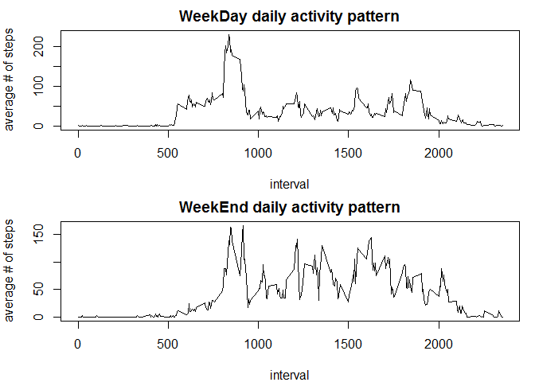

# Reproducible Research: Peer Assessment 1


## Loading and preprocessing the data

```r
library(dplyr)
```

```
## Warning: package 'dplyr' was built under R version 3.2.3
```

```
## 
## Attaching package: 'dplyr'
```

```
## The following objects are masked from 'package:stats':
## 
##     filter, lag
```

```
## The following objects are masked from 'package:base':
## 
##     intersect, setdiff, setequal, union
```

1. Unzip and load data into data frame 'activity'
2. Process/transform the data into a format suitable for the analysis
      a.  Transform the date from character into date
      b.  Add the "WeekDay"" column to tell whether the day is weekday or weekend

```r
library(dplyr)
if(!file.exists("activity.csv")) unzip("activity.zip")
activity<-read.csv("activity.csv",colClasses = c("integer","character","integer"))
str(activity)
```

```
## 'data.frame':	17568 obs. of  3 variables:
##  $ steps   : int  NA NA NA NA NA NA NA NA NA NA ...
##  $ date    : chr  "2012-10-01" "2012-10-01" "2012-10-01" "2012-10-01" ...
##  $ interval: int  0 5 10 15 20 25 30 35 40 45 ...
```

```r
activity$date<-as.Date(activity$date)
activity<-mutate(activity,WeekDay=as.factor(sapply(activity$date,function(x){wd<-weekdays(x);
  ifelse(wd=="Saturday"|wd=="Sunday","Weekend","Weekday")})))
```


## What is mean total number of steps taken per day?
1.  Sum steps for each day
2.  create Histogram to see distribution over the period
3.  calculate mean and median

```r
DailySum<-aggregate(steps~date,activity,sum,na.rm=TRUE)
par(mfrow=c(1,1),mar=c(4,4,5,1))
hist(DailySum$steps,breaks=10,xlab="Total # of steps each day",main="distribution of daily steps before filing missing values") 
```

\

```r
mean(DailySum$steps)   
```

```
## [1] 10766.19
```

```r
median(DailySum$steps) 
```

```
## [1] 10765
```

## What is the average daily activity pattern?
1.  Aggregate the average number of steps taken each interval
2.  Plot the average number of steps by intervals
3.  Find the interval with maximum number of steps

```r
steps_by_interval<-aggregate(steps~interval,activity,mean,na.rm=TRUE)
plot(steps_by_interval$interval,steps_by_interval$steps,type="l",xlab="interval",
     ylab="average # of steps",main="Daily activity pattern")
```

\

```r
steps_by_interval[steps_by_interval$steps==max(steps_by_interval$steps),1] 
```

```
## [1] 835
```

## Imputing missing values
First, we calculate the total number of missing values and their index in the dataset.

```r
sum(is.na(activity$steps))
```

```
## [1] 2304
```

```r
ndx<-which(is.na(activity$steps))
```
Then create a new dataset and fill the missing values with the mean of the corresponding 5-minute interval.

```r
activity_fillNA<-activity #create a new dataset for filling NA values
for(i in ndx) {
  activity_fillNA$steps[i]<-steps_by_interval[steps_by_interval$interval==activity_fillNA$interval[i],2]
}
```
Sum steps for each day with the new data frame after filling missing values,make the histogram, calculate mean and the median.

```r
DailySum_fillNA<-aggregate(steps~date,activity_fillNA,sum)
hist(DailySum_fillNA$steps,breaks=10,xlab="Total # of steps each day",main="distribution of daily steps after filling 
  missing values") 
```

\

```r
mean(DailySum_fillNA$steps) 
```

```
## [1] 10766.19
```

```r
median(DailySum_fillNA$steps)
```

```
## [1] 10766.19
```


The mean is kept the same, while the median is shifted a bit after inserting missing values with the mean of the corresponding 5-minute interval.

## Are there differences in activity patterns between weekdays and weekends?
1.  Aggregate the average steps by intervals for weekday and weekend into steps_interval_WD
2.  Subset steps_interval_WD to get average steps by intervals for weekday and weekend into WeekDay and WeekEnd
3.  Plot panel time series plot for  weekday and weekend

```r
steps_interval_WD<-aggregate(steps~WeekDay+interval,data=activity_fillNA,mean)
steps_interval_WD$WeekDay<-as.character(steps_interval_WD$WeekDay)
WeekDay<-subset(steps_interval_WD,WeekDay=="Weekday")
WeekEnd<-subset(steps_interval_WD,WeekDay=="Weekend")
par(mfrow=c(2,1),mar=c(4,4,2,1))
plot(WeekDay$interval,WeekDay$steps,type="l",xlab="interval",
     ylab="average # of steps",main="WeekDay daily activity pattern")
plot(WeekEnd$interval,WeekEnd$steps,type="l",xlab="interval",
     ylab="average # of steps",main="WeekEnd daily activity pattern")
```

\


We do see difference in activity patterns between weekdays and weekends. During the Weekdays, people are active mostly around 5~6am, while during the weekends, it seems to have higher activity levels than the weekdays and more scattered.
